# 玉結び（TAMAMUSUBI）マップ遷移図 — MAP_TRANSITION_GRAPH

> **自動生成**: `design/10-lists/data/gen_transition_graph.py`（正本 = `data/maps.json` の warp 接続）。
> 手編集しないこと。更新は maps.json → `build_data_json.py` → 本スクリプト再実行の順。

---

## §0 メタ・凡例

- **総マップ数**: 303 枚（地域 10 ＋ 連絡 LINK 16 枚）
- **走破順（正本 REGION_LIST §6 / PROGRESSION_DESIGN §1.1）**: R1 → R2 → R3 → R4 → R5 → R6 → R7 → R8 → R9 → R10
  - **rn-M4 再採番**: 走破順は R1→R10 の **単調昇順**（旧「末尾挿入採番」を廃止し、火の道は R6→R7 ゲートへ移設）。
  - **turn-054 接頭辞再採番**: map_id 接頭辞 `r{n}_` は region `R{n}` と一致（R7 火群=`r7_*`／R8 常世=`r8_*`／R9 綿津見=`r9_*`／R10 高天原=`r10_*`）。回転は決定的移行スクリプトで全 warp と同時更新（[REGION_RENUMBER_MAP §9]）。
- **凡例**:
  - `==>`（太線）= 地域間の進行ゲート（移動手段の解放を伴う一方向の物語進行）
  - `---`（無向線）= 地域内マップの隣接（warp による相互行き来）
  - `-.->`（点線）= ファストトラベル/裏ルート/条件付き接続
  - ノード注記 `[野外]/[町]/[D]/[祠]/[連絡]` = マップ種別

- **warp トークン会計**: 全 590 トークン中 585 件を edge 化（99.2%）。残り 5 件は `—`（無warp標識）のみ。物語終端トークン（「天之磐座(ラストボス)」「周回スタート地点」「クリア後ニューゲーム+」等）は全て実 map_id へ解決済み（後述 §6）。地域ラベル道標は全廃し、**全 warp トークンが実 map_id へ解決**（地域外部ラベルノードは 0）。（`verify_expansion_consistency.py` 項目8 で宙吊り0を機械保証）

---

## §1 リージョン俯瞰図（マクロ進行）

各リージョンを 1 ノードに畳み込み、地域間の進行ゲート（移動手段の解放）を太線で示す。
数値は Lv 帯と総マップ枚数。

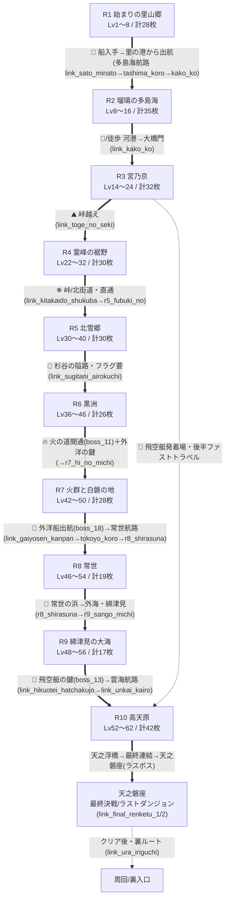

### 進行ゲート一覧（解放条件）

| # | From → To | 解放条件 | 連絡経路（map_id） |
|---|-----------|----------|--------------------|
| 1 | R1 → R2 | 船入手（里の港から出航） | link_sato_minato → link_tashima_koro_1/2 |
| 2 | R2 → R3 | 河港着・大橋門（徒歩/船） | link_kako_ko |
| 3 | R3 → R4 | 峠越え（推奨Lv22） | link_toge_no_seki |
| 4 | R4 → R5 | 峠/北街道・直通（推奨Lv30） | link_kitakaido_shukuba → r5_fubuki_no |
| 5 | R5 → R6 | 杉谷の隘路（物語フラグ要） | link_sugitani_airokuchi |
| 6 | R6 → R7 | boss_11撃破で火の道開通＋外洋の鍵 | → r7_hi_no_michi（火の道） |
| 7 | R7 → R8 | boss_18撃破＝正しい火の証→外洋船出航・常世航路 | link_gaiyosen_kanpan → link_tokoyo_koro_1/2 → r8_shirasuna |
| 8 | R8 → R9 | 常世の浜→外海（外洋船で綿津見へ） | r8_shirasuna → r9_sango_michi |
| 9 | R9 → R10 | boss_13＝飛空艇の鍵→雲海航路 | link_hikuotei_hatchakujo → link_unkai_kairo |
| 10 | R10 → 最終 | 天之浮橋→最終連結 | link_amanoukhihashi → link_final_renketu_1/2 → 天之磐座 |

---

## §2 連絡（LINK）スパイン詳細

地域間を結ぶ 16 枚の連絡マップ（航路・関・宿場・飛空艇）。物語進行の背骨。

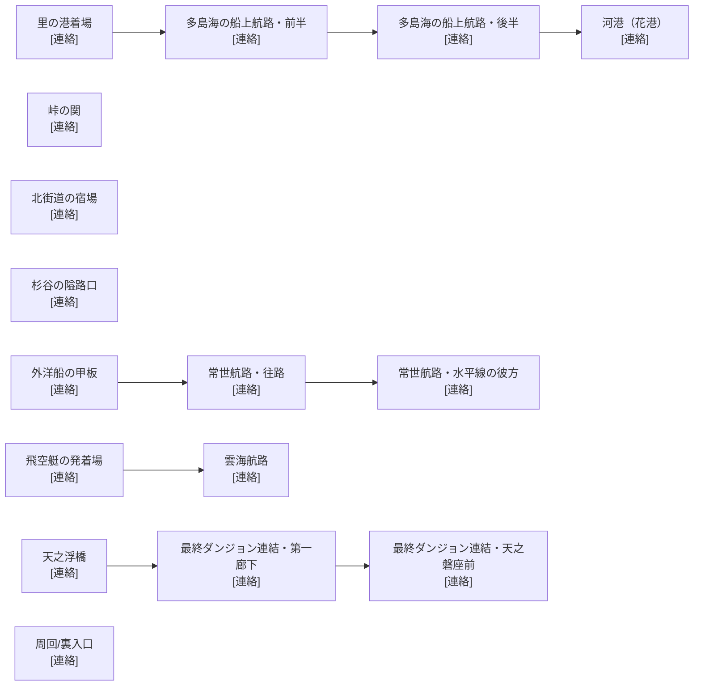

---

## §3 地域別 詳細遷移図

各マップをノード、warp を辺として描画。1 マップから複数マップへ分岐するハブを明示する。
太線（`==>`）は他地域への出入口。

### R1 — 始まりの里山郷（Lv1〜8 / 28枚）

- 解放条件: 初期（徒歩・物語開始地点）
- 内訳: 野外12 / 町6 / D6 / 祠4

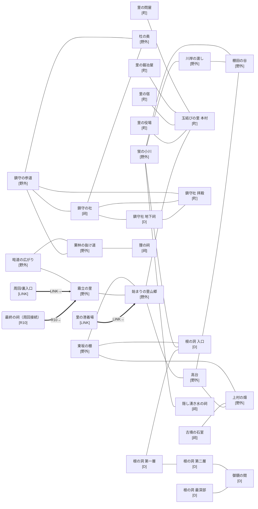

### R2 — 瑠璃の多島海（＋砂丘サブゾーン）（Lv8〜16 / 35枚）

- 解放条件: 船入手後（里の港から出航）
- 内訳: 野外18 / 町6 / D6 / 祠5

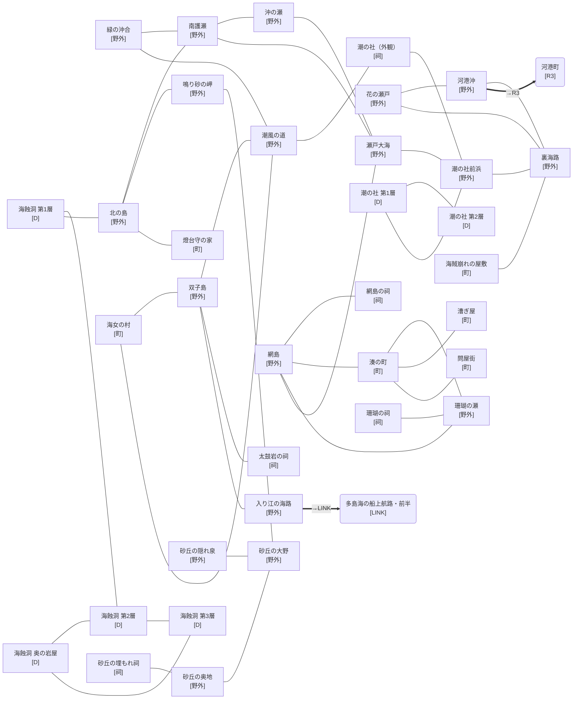

### R3 — 宮乃京（Lv14〜24 / 32枚）

- 解放条件: 徒歩（街道）／船（河港）
- 内訳: 野外10 / 町12 / D6 / 祠4

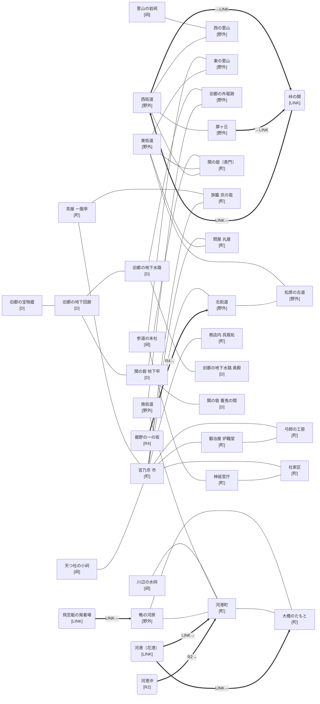

### R4 — 霊峰の裾野（Lv22〜32 / 30枚）

- 解放条件: 徒歩（宮乃京から峠越え）
- 内訳: 野外14 / 町4 / D8 / 祠4

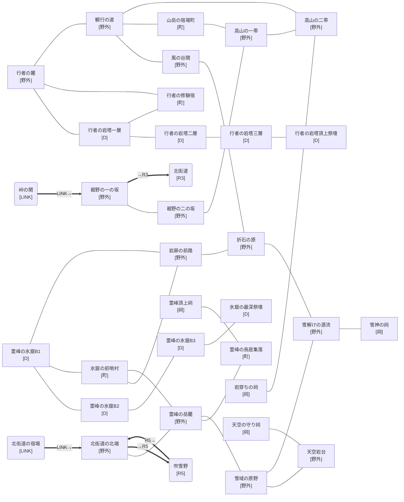

### R5 — 北雪郷（Lv30〜40 / 30枚）

- 解放条件: 徒歩（R4 霊峰から峠／街道で直通）／船（沿岸）
- 内訳: 野外14 / 町6 / D6 / 祠4

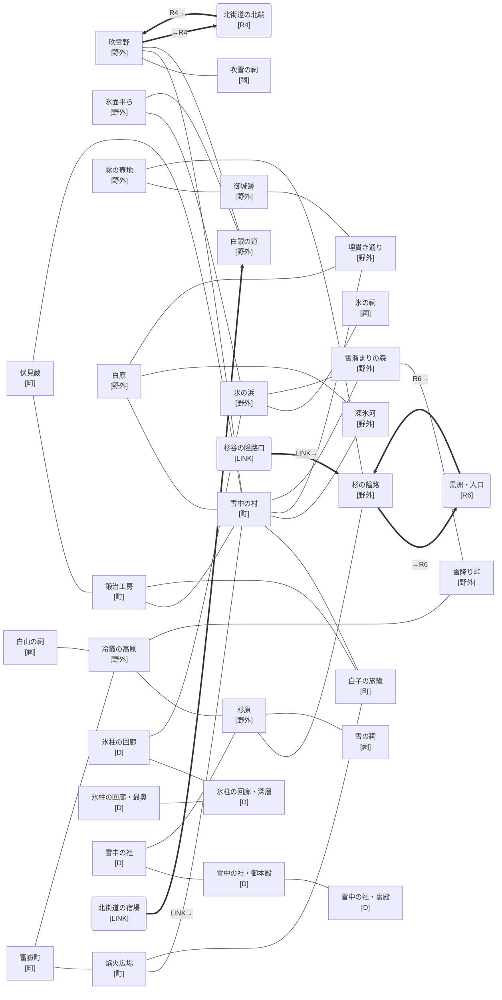

### R6 — 黒洲（Lv36〜46 / 26枚）

- 解放条件: 徒歩（R5 北雪郷から杉谷の隘路・フラグ要）
- 内訳: 野外12 / 町2 / D8 / 祠4

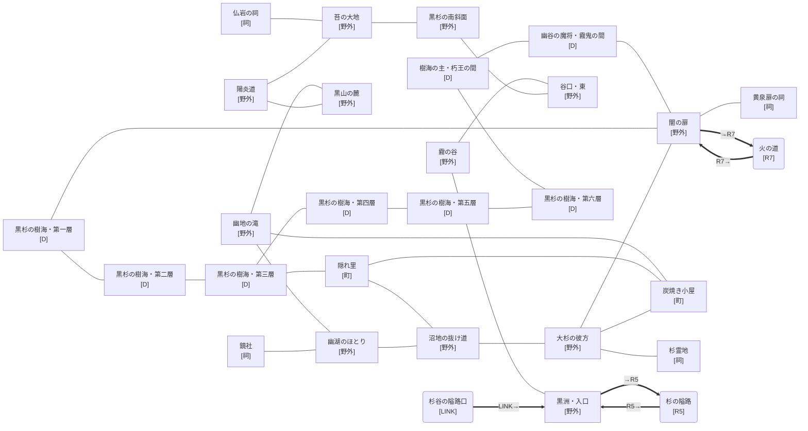

### R7 — 火群と白磐の地（Lv42〜50 / 28枚）

- 解放条件: 徒歩（R6 から「火の道」）
- 内訳: 野外8 / 町8 / D6 / 祠6

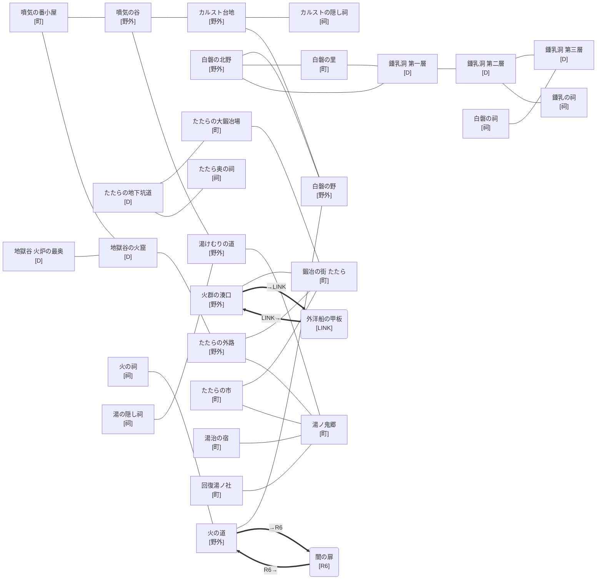

### R8 — 常世（聖域・無戦闘）（Lv46〜54 / 19枚）

- 解放条件: 外洋船（R7 ホムラの湊から常世航路へ）
- 内訳: 野外6 / 町4 / D2 / 祠7
- ⚠ **R8 常世は完全無戦闘の聖域**（敵0・ボス0）。戦闘は隣接する R9 綿津見の大海に分離。map_id は `r8_` 接頭辞（region R8 と一致）。

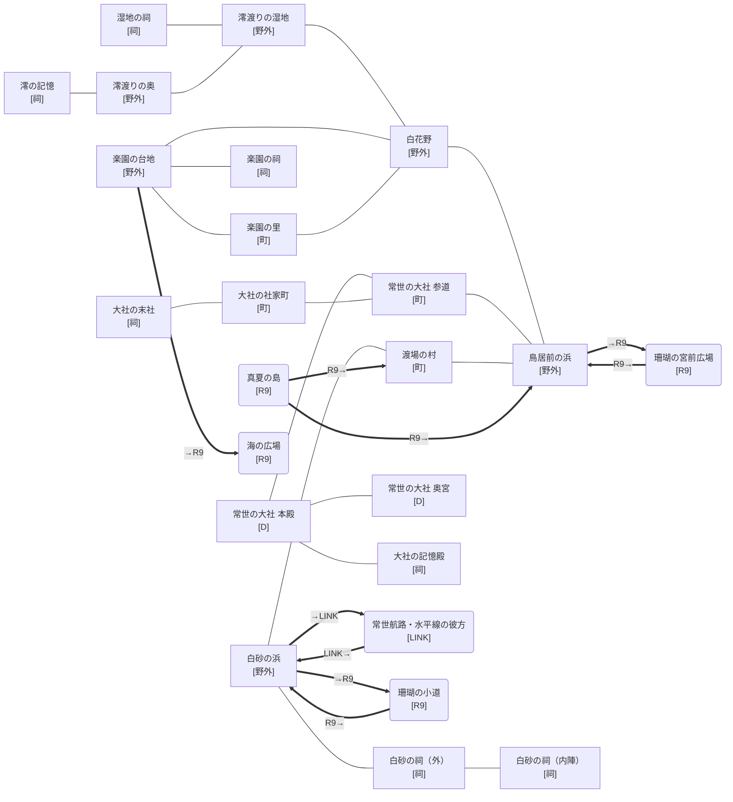

### R9 — 綿津見の大海（Lv48〜56 / 17枚）

- 解放条件: 常世の浜から外海へ（綿津見の試練・飛空艇の鍵）
- 内訳: 野外10 / 町2 / D4 / 祠1
- ⚠ **R9 綿津見は町（海岸の町/真夏の島）を中核戦闘ハブ**とし、**砂浜・岩礁・深海も戦闘可**の美麗フィールド。map_id は `r9_` 接頭辞（region R9 と一致）。

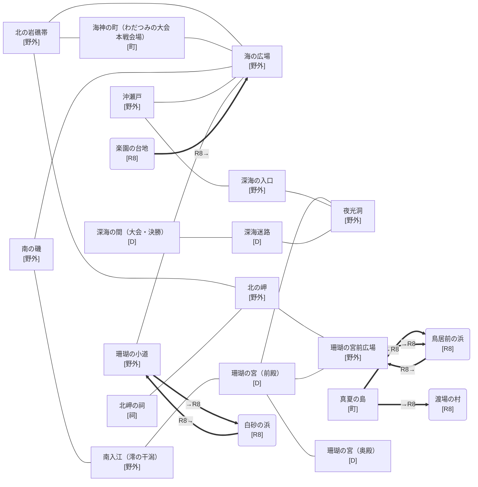

### R10 — 高天原（＋架け橋/森/星空）（Lv52〜62 / 42枚）

- 解放条件: 飛空艇（高天原への昇陟）
- 内訳: 野外16 / 町8 / D10 / 祠8

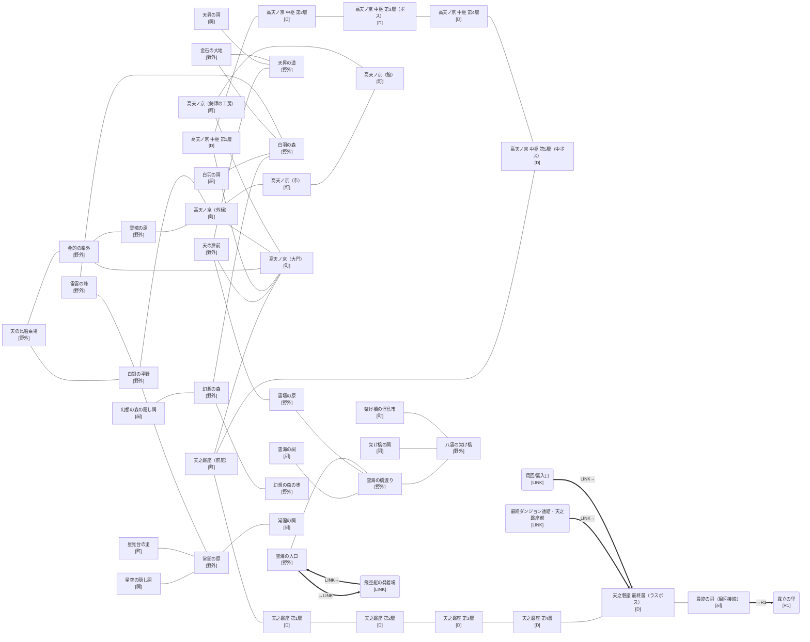

---

## §4 多対多接続ハブ一覧（接続次数 ≥4）

1 マップから多方向へ分岐する分岐点。導線設計の要所。

| map_id | 名前 | 地域 | 接続次数 |
|--------|------|------|----------|
| `r3_ichi` | 宮乃京 市 | R3 | 9 |
| `r5_setchu_mura` | 雪中の村 | R5 | 9 |
| `r3_kominato` | 河港町 | R3 | 6 |
| `r6_yami_tobira` | 闇の扉 | R6 | 6 |
| `r8_shirasuna` | 白砂の浜 | R8 | 6 |
| `r8_torii_mae` | 鳥居前の浜 | R8 | 6 |
| `r9_umi_hiroba` | 海の広場 | R9 | 6 |
| `r10_takama_kyo_mon` | 高天ノ京（大門） | R10 | 6 |
| `tama_musubi_sato` | 玉結びの里 本村 | R1 | 5 |
| `satoyama` | 始まりの里山郷 | R1 | 5 |
| `r3_kaido_nishi` | 西街道 | R3 | 5 |
| `r7_yunokigou` | 湯ノ鬼郷 | R7 | 5 |
| `r5_fubuki_no` | 吹雪野 | R5 | 5 |
| `r5_sugi_no_iarou` | 杉の隘路 | R5 | 5 |
| `chinju_yashiro` | 鎮守の社 | R1 | 4 |
| `hotaru_ogawa` | 蛍の小川 | R1 | 4 |
| `kiritate` | 霧立の里 | R1 | 4 |
| `chinju_sando` | 鎮守の参道 | R1 | 4 |
| `r2_futago_jima` | 双子島 | R2 | 4 |
| `r2_amijima` | 網島 | R2 | 4 |
| `r2_minato` | 湊の町 | R2 | 4 |
| `r2_seto_ooumi` | 瀬戸大海 | R2 | 4 |
| `r2_nango_se` | 南護瀬 | R2 | 4 |
| `r2_shio_kaze_michi` | 潮風の道 | R2 | 4 |
| `r2_kita_no_shima` | 北の島 | R2 | 4 |
| `r2_ura_umi` | 裏海路 | R2 | 4 |
| `r2_shio_no_yashiro_mae` | 潮の社前浜 | R2 | 4 |
| `r3_kaido_higashi` | 東街道 | R3 | 4 |
| `r4_kanko_michi` | 観行の道 | R4 | 4 |
| `r4_reiho_dake` | 霊峰の岳麓 | R4 | 4 |
| `r4_kitakaidou_n` | 北街道の北端 | R4 | 4 |
| `r7_hi_no_michi` | 火の道 | R7 | 4 |
| `r7_tatara_machi` | 鍛冶の街 たたら | R7 | 4 |
| `r5_sugi_hara` | 杉原 | R5 | 4 |
| `r5_reika_kougen` | 冷霞の高原 | R5 | 4 |
| `r5_kori_no_hama` | 氷の浜 | R5 | 4 |
| `r6_ooksugi_kanata` | 大杉の彼方 | R6 | 4 |
| `r6_kurosugi_iriguchi` | 黒洲・入口 | R6 | 4 |
| `r8_rakuen_daichi` | 楽園の台地 | R8 | 4 |
| `r8_shirohana_no` | 白花野 | R8 | 4 |
| `r9_sango_miya` | 珊瑚の宮（前殿） | R9 | 4 |
| `r9_sango_miya_mae` | 珊瑚の宮前広場 | R9 | 4 |
| `r10_tokoyami_hara` | 常闇の原 | R10 | 4 |
| `r10_shirogane_heiya` | 白銀の平野 | R10 | 4 |
| `r10_shirohane_no_mori` | 白羽の森 | R10 | 4 |
| `r10_d_ame_no_iwakura_final` | 天之磐座 最終層（ラスボス） | R10 | 4 |
| `r10_unkai_hashi` | 雲海の橋渡り | R10 | 4 |
| `r10_takama_kyo` | 高天ノ京（外縁） | R10 | 4 |
| `link_hikuotei_hatchakujo` | 飛空艇の発着場 | LINK | 4 |
| `link_toge_no_seki` | 峠の関 | LINK | 4 |

---

## §5 カバレッジ整合

- **ノード網羅**: §3 に地域マップ 287 枚、§2 に連絡 16 枚 = 計 303 枚を掲載（maps.json 総数 303 と一致）。
- **地域内隣接エッジ**: 330 本（無向・重複排除済）。
- **地域間エッジ**: 38 本（有向）。

---

## §6 warp 解決台帳（宙吊り0・全エッジ整合）

かつて旧地域ラベル・散文終端で残っていた warp トークンは **全て実 map_id へ解決済み**。
`verify_expansion_consistency.py` 項目8（warpターゲット整合）が、全 warp トークンが「実 map_id」へ解決すること（無warp標識 `—` を除く・地域ラベル等の例外 allowlist は廃止）＝**宙吊り0・全エッジが実ノード** を機械保証する（CI オラクル）。

### §6.1 物語終端・旧ラベルの解決結果（代表）

| 旧トークン | 解決先 map_id | 区分 |
|------------|----------------|------|
| 天之磐座(ラストボス) / 天之磐座(裏ルート) | `r10_d_ame_no_iwakura_final` | ラスボス層へ集約 |
| 周回スタート地点 / クリア後ニューゲーム+ 専用入口 | `kiritate` | 周回(NG+)は物語開始地 霧立の里へ |
| R3宮乃京・大橋門（河港着） | `r3_kominato` / `r3_ohashi` | 河港町・大橋のたもと |
| R4雪原の辺境（峠の関→R4） | `r4_suso_ichi` / `r4_kitakaidou_n` | 霊峰の裾野 入界点 |
| R5深森の隠れ里（→R5/R6隘路） | `r5_shirogane_michi` / `r5_sugi_no_iarou` | 北雪郷 入界点・杉の隘路 |
| R8天上の浮島（常世航路/飛空艇） | `r8_shirasuna` / `r10_unkai` | 常世の白砂・雲海の入口 |

> 未解決の散文終端トークン: **0 件**（全て実 map_id へ解決済み）。

### §6.2 地域ゲートウェイ（道標）の結線状況

**地域ラベル道標は全廃済み（0 件）**。かつて宮乃京(R3)の東/南/北街道・雲海入口に残っていた 非map_id道標（`R2北出口` / `R5南出口` / `R6北山出口` / `R8最終出口`）は、いずれも逆方向 warp が既存の実 map_id へ双方向結線した（`r3_kaido_higashi`→`r3_satoyama_higashi` / `r3_kaido_minami`→`r3_suiro_ura` / `r3_kaido_kita`→`r3_matsubara` / `r10_unkai`→`link_hikuotei_hatchakujo`）。これにより本遷移図の全エッジが実マップノードへ解決し、verify 項目8 の allowlist 例外は廃止された。

---

## §7 ラストダンジョン（最終盤）接続メモ

`SCENARIO_SYNOPSIS.md` 付録C の最終盤候補3案を受け、現データ上の最終連結は次の通り（確定はユーザー承認後）。

- 現状: `R10 高天原` → `link_amanoukhihashi`（天之浮橋）→ `link_final_renketu_1`（第一廊下）→ `link_final_renketu_2`（天之磐座前）→ **`r10_d_ame_no_iwakura_final`（天之磐座 最終層・ラスボス boss_16 玉の主神）**。
- 「高天原の先のもう一つのラストダンジョン」は、この最終連結（link_final_renketu_1/2）を独立地域として基本設計化する案が最有力。
- クリア後: `link_ura_iriguchi`（周回/裏入口）→ `r10_d_ame_no_iwakura_final`（裏ルート）／周回開始は `kiritate`（物語開始地）へ。
